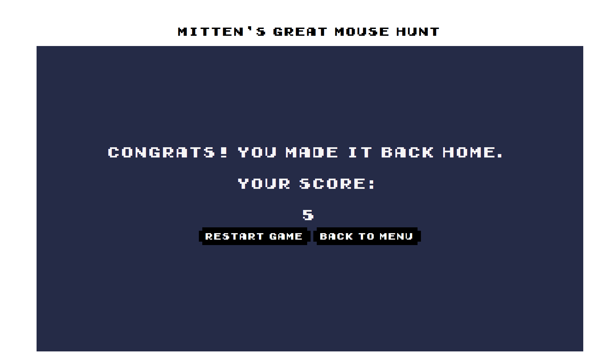

# Mittens-Great-Mouse-Hunt
Mitten's Great Mouse Hunt is a platformer game, where the player takes the role of Mitten, a cat who's toys have been strewn about the neighbourhood by some mean dogs. The goal is to collect all mice and not get hit by the dogs. The game is made using html canvas and JavaScript.

